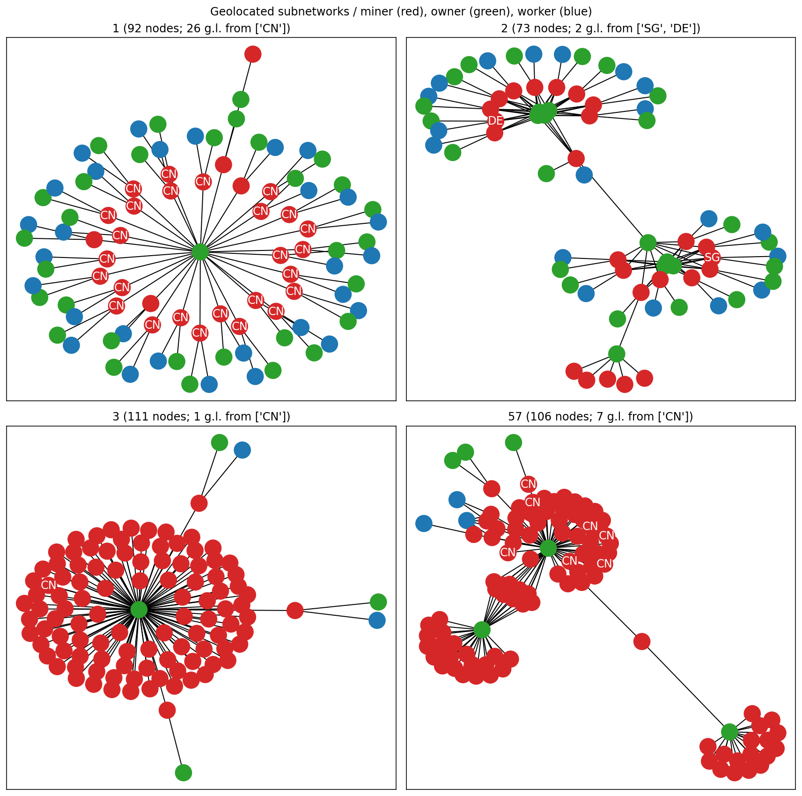

# filecoin-miner-network

This repository contains a workflow to perform relationship mining between miners, workers and owners on the Filecoin network. 

A Prefect workflow to map `miner_id`s to an entity and geographic location is provided in `main.py`. To find the top 1000 most important subgraphs of the system, it takes a reasonable 11 minutes on my system. 

For demonstration notebooks, see `notebooks`.